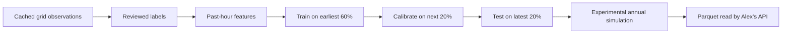

# Kristian's first ML pipeline

For a browser interface, double-click **Open ML Workspace.cmd** in the repository
and open **http://127.0.0.1:8765**. The [workspace guide](ML_WORKSPACE.md) covers
area entry, real-data charts, event-label uploads, training and model downloads.
The commands below remain available for direct or advanced use.

You own the part that turns historical grid observations into a tested model and
precomputed modeled-exposure results. This is a tabular machine-learning problem:
the first model uses an ensemble of LightGBM decision trees. You do not need to
train a language model, use an OpenAI API key, or buy a GPU for this version.

The code is a research prototype for **SPP**, following the current team scope.
It is implemented and tested, but **no model has yet been trained on real event
labels**. Real SPP load data is downloaded and cleaned. You can now
[enter a city/state and add its historical temperatures](TEMPERATURE_DATA.md).
The remaining data dependency is matching, reviewed event/proxy evidence.

## What has already been done on your machine

- Created `.venv` with Python 3.12.2 and installed the ML packages.
- Downloaded SPP's real 2024 hourly-load archive. The old daily URL returned 404;
  the annual ZIP worked. Raw data and its source URL are cached under
  `data/raw/spp/access_check/` and are gitignored.
- Normalized the archive to
  `data/processed/ml_inputs/spp_2024_load_only.parquet`.
- Found 17,562 raw rows, removed 8,779 exact duplicate rows, and marked one
  conflicting hour unknown. Inserted two missing hourly slots as unknown.
  The result has 8,784 hourly slots and 8,781 known load values. These are
  **data-quality counts, not modeled exposure**.
- Built the data validator, evidence join, label builder, historical features,
  calibrated ensemble, confidence diagnostics, experimental simulation, and
  `get_location_estimate()` reader.
- Prepared an example joining Amarillo temperatures to all 8,784 grid hours in
  `data/processed/ml_inputs/spp_2024_amarillo_temperature.parquet`. Use the
  [area-input guide](TEMPERATURE_DATA.md) to choose your own weather area.
- All 40 pipeline/workspace tests pass, including actual training and model-file creation using **synthetic software-test
  fixtures in temporary directories**. Those metrics are not evidence of SPP model
  performance; the fixtures never enter the real-data cache or frontend.

The 2024 archive spans local operating-year boundaries in UTC. The adapter treats
`MarketHour` as UTC hour-ending, matching gridstatus's SPP loader, and subtracts an
hour for the interval-start key. It sums the 17 named load areas only when all
components are present. `SPP_SYSTEM` means that system aggregate; it is not a
validated pricing-node or site identifier.

## 1. Understand what the model predicts

For each target hour, the classifier estimates:

> Given the observations from previous hours, how likely is this hour to meet our
> agreed system-event or grid-stress-proxy definition?

It does not determine whether a particular data center was or will be curtailed.
The team's `site_exposure` assumption is applied downstream by the API.



The percentages are chronological windows over the usable timestamp sequence,
with a 24-hour gap before calibration and before testing. All locations share the
same cutoffs. The one-hour classifier and the multi-year simulation are different
stages: the latter needs assumptions about future conditions.

## 2. Run the commands you can use immediately

Open PowerShell in the repository:

```powershell
Set-Location 'C:\Users\krist\Hackathon\East-v-west-hackathon-2026'
.\.venv\Scripts\python.exe -m pipeline.workflow --help
.\.venv\Scripts\python.exe -m unittest discover -s tests -v
.\.venv\Scripts\python.exe -m pipeline.workflow inspect --hourly data/processed/ml_inputs/spp_2024_load_only.parquet
```

Calling the environment's Python directly avoids PowerShell activation-policy
problems. For another machine, install Python 3.12, run `python -m venv .venv`, then:

```powershell
.\.venv\Scripts\python.exe -m pip install -r requirements-ml.txt
```

The tested environment used pandas 2.3.3, NumPy 2.5.3, scikit-learn 1.9.1,
LightGBM 4.7.0, gridstatus 0.36.0, and PyArrow 25.0.1. Each model card records its
actual package versions, input hashes, settings, and source references.

The following steps were already run here. On a fresh checkout, fetch and prepare:

```powershell
.\.venv\Scripts\python.exe -m pipeline.workflow fetch-sample
.\.venv\Scripts\python.exe -m pipeline.workflow prepare-load --raw data/raw/spp/access_check/2024_hourly_load.parquet --out data/processed/ml_inputs/spp_2024_load_only.parquet
```

The fetch checks its parquet cache first. Preparation refuses to overwrite an
existing output. The existing general `pipeline.ingest` downloader remains
available, but its other live dataset calls have not been validated in this task.
Avoid starting years of five-minute pulls before checking a small sample and cache
behavior: gridstatus may perform many underlying requests.

Before adding evidence, optionally run `add-temperature --area "City, State"`
using the [temperature guide](TEMPERATURE_DATA.md). Use that new temperature-enabled
parquet as `--hourly` in the evidence join below. Existing labeled inputs can also
receive temperatures; adding weather preserves their event columns.

## 3. Add the evidence that defines a positive hour

The model needs examples of both positive and negative hours. Choose exactly one
target with the team and document it in a policy JSON file:

| `label_method` | Required input columns | Exact implemented rule |
|---|---|---|
| `observed_event` | `event_active` | 1 = reviewed event hour; 0 = confirmed covered, non-event hour; missing = unknown |
| `reserve_shortfall` | `available_reserves_mw`, `required_reserves_mw` | Available is strictly below required, for the same product, time, and region |
| `binding_constraint` | `binding_constraint_count` | Count is greater than zero, based on a complete observed hour |
| `scarcity_price` | `lmp_usd_mwh` | Price is strictly above the explicit `price_threshold_usd_mwh` in the policy |

There is **no automatic fallback** between these targets. Binding constraints and
scarcity prices are proxies, and their occurrence does not prove load was cut.
If nearly every hour is positive for a system-wide constraint target, that target
will not distinguish rare stress well. Review it instead of inventing negative
examples. A scarcity threshold is a named assumption or sourced policy, never a
quantile tuned on the test data.

For the default observed-event route, prepare a CSV with this header:

```csv
timestamp_utc,location_id,event_active
```

Use UTC hour-start timestamps with `Z` or `+00:00`, location `SPP_SYSTEM` for this
aggregate, and a 0/1 value only where the event source has confirmed coverage.
When translating event start/end times into hourly labels, have the team agree
whether a partly affected hour counts as a whole hour. Keep that definition in
`label_ref`. Do not treat gaps in the event archive as normal hours.

Save the real evidence as `data/raw/spp/events_hourly.csv`, then join it:

```powershell
.\.venv\Scripts\python.exe -m pipeline.workflow join-evidence --hourly data/processed/ml_inputs/spp_2024_load_only.parquet --evidence data/raw/spp/events_hourly.csv --out data/processed/ml_inputs/spp_labeled_inputs.parquet
```

The same command can join reserve quantities, prices, weather, or other supported
sensor columns. It uses exact `(timestamp_utc, location_id)` matches, rejects
duplicates and overwritten columns, and leaves unmatched evidence unknown.
Evidence must already be hourly. Preserve short stress intervals when aggregating
five-minute records; do not assume an hourly mean preserves every event.

Copy `docs/ml-policy.example.json` to `data/processed/ml_inputs/policy.json`.
Fill its empty `label_ref` with the real event archive, scope, coverage, and hourly
definition. The empty reference deliberately fails validation. Add all input source
references to `data_ref` when joining additional datasets. A policy does not verify
its citations automatically; the references must correspond to the supplied data.

The currently downloaded load table alone cannot pass this stage. PJM exports
should not be relabeled as SPP observations.

## 4. Train and calibrate the ensemble

Once the joined input and policy exist:

```powershell
.\.venv\Scripts\python.exe -m pipeline.workflow train --hourly data/processed/ml_inputs/spp_labeled_inputs.parquet --policy data/processed/ml_inputs/policy.json --run-dir data/processed/ml_run_01
```

Here is what happens:

1. **Validate:** check time zones, duplicate keys, finite numeric values, and labels.
2. **Build features:** calendar cycles; 1-, 24-, and 168-hour lags; previous-day
   means and variation. All observed inputs come from hours before the target.
   Columns defining a proxy target are excluded even from lagged predictors.
3. **Train:** fit 15 small LightGBM models, each on a seeded resample of complete
   training-day blocks. LightGBM learns decision-tree splits relating the input
   features to the labels. Missing optional predictors remain missing.
4. **Calibrate:** fit a sigmoid mapping from each model's raw score to probability
   using only the middle time window. This mapping can improve probability estimates
   but is not guaranteed to do so; both raw and calibrated test scores are recorded.
5. **Test:** score the untouched final window and compare with the event rate learned
   from the training window. Test labels never update the trees or calibrators.

Every split needs at least 72 usable rows and at least five positive and five
negative labels. These are execution safeguards, not proof that the data is
sufficient. Rare events need much more history and enough independent episodes.
A larger gap or event-grouped boundaries may be needed for events spanning days.
The current retrospective study assumes prior-hour measurements are available;
a deployable live forecast also needs actual publication-delay checks.

Use a new run directory for each experiment. Existing results are never overwritten
by training. Don't tune against the same final test repeatedly: reserve another
untouched period if you iterate on the model after inspecting its performance.

## 5. Decide whether the model is useful

Open `data/processed/ml_run_01/REPORT.md` and `model_card.json`.

| Output | What to inspect |
|---|---|
| Brier score | Lower is better. The calibrated model should beat the training-prevalence baseline. |
| Log loss | Lower is better; confidently wrong predictions are penalized. |
| Average precision | Compare with the positive-hour rate, particularly for rare events. |
| Reliability bins | Do hours receiving similar probabilities have similar observed event rates? Inspect sample counts too. |
| Split dates and counts | Are there enough events and all relevant seasons in each window? |
| Confidence diagnostics | Ensemble disagreement and the count of similar historical hours; inspect limitations before reading the badge. |

The confidence score is `1 - 2 * mean(ensemble probability standard deviation)`,
clipped to 0..1. It measures agreement, not correctness. The precedent count is the
median number of same-location training hours within 0.5 root-mean-square standard
deviations of up to 256 sampled test feature vectors. Scaling and missing-value
medians are fitted on training data only. This count is not a count of independent
events. Missing optional sensors and correlated hours can overstate similarity.

The score thresholds and support thresholds are explicit in
`pipeline/confidence.py:CONFIDENCE_POLICY` and copied into each model card. A model
that fails to beat the baseline, has fewer than 20 positive test hours, or has less
than a full year of held-out coverage gets a Low badge regardless of agreement.
These are provisional diagnostic rules requiring review, not empirically validated
confidence categories. Agreement can be high when every ensemble member is wrong.

Training creates a local `model.joblib`, labeled hours, features, held-out hourly
probabilities, confidence diagnostics, the model card, and the readable report.
Only load model files you created or trust; joblib is a Python serialization format.

## 6. Generate experimental annual exposure distributions

After a satisfactory real-data backtest and label/calibration review:

```powershell
.\.venv\Scripts\python.exe -m pipeline.workflow simulate --run-dir data/processed/ml_run_01 --simulations 2000 --years 7
.\.venv\Scripts\python.exe -m pipeline.workflow estimate --location SPP_SYSTEM --path data/processed/ml_run_01/exposure_by_location.parquet
```

This requires at least one full year of held-out reference history and complete
seven-day blocks in every month. With a 60/20/20 split, plan for roughly **five or
more years of usable history**, allowing extra time for gaps and embargoes. A single
year is sufficient to exercise training when event counts permit, but cannot
support this simulation route. The current 2024 load download is only a starting set.

The experimental simulation uses paired blocks of calibrated probabilities and
randomized binary-outcome residuals from held-out history. Resampling the pairs
retains observed within-block episode structure; choosing a different ensemble
member changes the event thresholds. It is a historical resampling method with
model uncertainty, **not a validated structural forecast of future grid evolution**.

It assumes stationary conditions within each calendar month, uses a 365-day
comparison year, holds one ensemble member fixed per simulated contract, and
resamples seasonal blocks across years. It has no demand-growth or climate trend.
Block boundaries can split or join episodes. `worst_contiguous_hours` is defined
here as the p99 of each year's longest modeled episode, not an absolute maximum.
Annual tails still require independent validation and sensitivity checks for block
length, reference years, and simulation count.

Outputs are the annual quantiles, the individual trials, and a source/assumption
manifest. Annual confidence is capped Low; the numeric score remains classifier
agreement and must not be presented as annual-tail coverage. This interpretation
and the contiguous-hour statistic need Alex's review against the shared contract.

## 7. Hand the result to Alex

The output columns match section 1 of `docs/BUILD_PLAN.md`. The reader is:

```python
from pipeline.simulate import get_location_estimate

# Default reads data/processed/exposure_by_location.parquet only.
estimate = get_location_estimate("SPP_SYSTEM")
```

The CLI initially writes research artifacts inside the selected run directory.
After review, Alex can promote the reviewed parquet to the canonical path and
preserve the model card and simulation manifest beside it. The reader never trains,
simulates, or fetches. Unknown locations raise `LocationNotFoundError`.

Keep `SPP_SYSTEM` labeled as a system aggregate until real location differentiation
is implemented. Do not duplicate its numbers under invented hub IDs. The API
applies `site_exposure`; the pipeline never multiplies by it. The frontend still
uses its existing illustrative data and has not been connected to these artifacts.

## Review before using real output in the demo

`AGENTS.md` explicitly requires close human review for `pipeline/label.py`, the
calibration logic in `pipeline/train.py`, and model-boundary wording. The concrete
review items are:

- The source, coverage, and exact hourly event/proxy rule in the policy.
- The causal feature timing, chronological windows, and sigmoid calibration.
- The confidence score interpretation and provisional thresholds.
- The stationary residual-block simulation and the annual contiguous-hour statistic.
- Whether a system aggregate is sufficient for the first integrated demo.

## Primary references

- [Shared pipeline/API contract](BUILD_PLAN.md)
- [Repository agent instructions](../AGENTS.md)
- [Gridstatus SPP implementation](https://opensource.gridstatus.io/en/latest/_modules/gridstatus/spp.html)
- [Scikit-learn probability calibration](https://scikit-learn.org/stable/modules/calibration.html)
- [SPP 2024 hourly-load archive](https://portal.spp.org/file-browser-api/download/hourly-load?path=/2024/2024.zip)

Your next concrete step is to obtain the reviewed hourly event/proxy evidence and
fill `label_ref`. The load table, local Python environment, code, and test harness
are already prepared.
